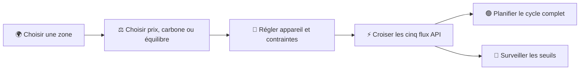

<div align="center">
  
  <h1>⚡ Wattwise</h1>
  <p><strong>Consommez au bon moment.</strong></p>
  <p>
    Une PWA mobile-first qui transforme les prévisions du prix de l’électricité<br />
    en recommandations simples, visuelles et directement utiles.
  </p>

  <p>
    
    
    
    
    
  </p>
</div>

---

## 👀 Aperçu


<table>
  <tr>
    <td width="68%">
      
      <br />
      <sub><strong>Prévisions détaillées :</strong> courbe horaire, niveaux relatifs, minimum, moyenne et maximum.</sub>
    </td>
    <td width="32%" align="center">
      
      <br />
      <sub><strong>Mobile-first :</strong> interface tactile et thème sombre.</sub>
    </td>
  </tr>
</table>

## 🎯 À quoi sert Wattwise ?

Wattwise répond à une question concrète :

> **Quand consommer au meilleur prix et au plus faible impact ?**

L’application récupère les prévisions *day-ahead* d’[Electricity Maps](https://www.electricitymaps.com/), les analyse, puis présente l’information importante sans jargon :

| Indicateur | Ce qu’il apporte |
| --- | --- |
| 🟢 **Meilleur créneau** | L’heure la moins chère pour lancer un appareil énergivore |
| 📉 **Prix minimum** | Le prix le plus bas de la période sélectionnée |
| ⚖️ **Prix moyen** | Le niveau de référence des prochaines 24, 48 ou 72 heures |
| 📈 **Prix maximum** | Le prix le plus élevé prévu |
| ✅ **Période avantageuse** | Le prochain ensemble d’heures relativement bon marché |
| ⚠️ **Prochain pic** | Le prochain moment où le prix devient particulièrement élevé |
| 💰 **Économie potentielle** | L’écart entre le meilleur créneau et le prix moyen |
| 🔌 **Planificateur d’appareil** | Le créneau et le coût estimé d’un cycle complet |
| 🌿 **Impact énergétique** | L’intensité carbone, la part renouvelable et le mix du créneau |
| 🔔 **Alertes** | Le prochain moment où vos seuils prix, carbone ou renouvelables sont atteints |

## ✨ Fonctionnalités

- ❓ **Guide intégré** depuis le bouton « ? » : premiers pas, estimations et FAQ sur les alertes et les données
- 💬 **Explications contextuelles** : prix publié ou prévu, gCO₂e/kWh, renouvelable et bas carbone
- 🧩 **Contraintes expliquées** : raison de l’absence de créneau et suggestion adaptée
- 🚗 **Objectif de recharge vérifié** : cible déjà atteinte ou durée supérieure à 12 h signalée, sans recommandation de recharge incomplète
- 🌍 **Six zones européennes** : France, Allemagne, Belgique, Espagne, Italie du Nord et Pays-Bas
- 🕐 **Prix publiés et prévus sur 24 h, 48 h et 72 h** lorsque le plan API les autorise
- ⚖️ **Trois modes d’optimisation** : économique, écologique ou équilibré avec pondération réglable
- 🌿 **Signaux carbone et renouvelables** superposables au graphique des prix
- 🧬 **Mix électrique expliqué** au début du créneau recommandé, avec flux import/export
- 🔌 **Planification d’appareils** : lave-linge, lave-vaisselle, sèche-linge, chauffe-eau, voiture électrique ou profil libre
- ⏱️ **Contraintes réalistes** : début au plus tôt, fin au plus tard, heures silencieuses et puissance maximale du logement
- 🚗 **Recharge électrique par objectif batterie** : capacité, niveau actuel et niveau cible
- 💶 **Coût et empreinte carbone estimés** selon la puissance et la durée, avec comparaison au prix moyen
- 📜 **Historique des prix sur 24 h** et distinction visuelle entre valeurs publiées et prévisions modélisées
- 🎯 **Qualité des prévisions mesurée localement** par erreur absolue moyenne et biais dès que des valeurs publiées sont disponibles
- 🔔 **Alertes prix, carbone et renouvelables** avec seuils, anticipation et notifications PWA
- 📊 **Graphique tactile et responsive** avec tooltip, quintiles et repères statistiques
- 🎨 **Classification relative** : très bon marché, bon marché, moyen, cher et très cher
- 🌗 **Thèmes système, clair et sombre**
- 📱 **PWA installable** avec manifeste, icône, mode standalone et service worker
- 📴 **Continuité hors ligne** grâce à la dernière prévision disponible, toujours signalée comme ancienne
- 🔄 **Cache de 15 minutes** pour limiter les appels API inutiles
- ♿ **Interface accessible** : labels, navigation clavier, contraste et informations non dépendantes de la couleur
- 🔐 **Clé API protégée côté serveur**, jamais incluse dans le navigateur

## 🧭 Parcours utilisateur



La barre inférieure donne un accès direct à **Accueil**, **Planifier**, **Prévisions**, **Impact** et **Alertes**. Les préférences générales restent disponibles en bas du tableau de bord.

Le bouton **« ? »** de l’en-tête ouvre le guide, même lorsque les données sont indisponibles.
Il explique les réglages, les unités, les limites des estimations et le fonctionnement des notifications.
Le guide se ferme avec **Fermer** ou la touche **Échap**.

Si aucun créneau n’est possible, le tableau de bord précise la cause : puissance dépassée,
données futures insuffisantes, durée non couverte, heures silencieuses ou horaires incompatibles.
Pour la voiture électrique, le calcul suppose un rendement de 90 %. Une recharge nécessitant
plus de 12 h affiche la durée estimée et le niveau atteignable en 12 h ; elle ne produit pas de
créneau présenté comme suffisant pour atteindre la cible. Une cible déjà atteinte ne déclenche
pas de recommandation de recharge.

## 🧠 Comment les recommandations sont calculées

Wattwise n’utilise pas de seuils monétaires arbitraires. Chaque prix est comparé aux autres valeurs de la période affichée grâce à des **quintiles**.

```text
Prix de la période
       ↓
Tri et calcul des quintiles
       ↓
Très bon marché → Bon marché → Moyen → Cher → Très cher
       ↓
Meilleur créneau + prochaines périodes + prochain pic
```

L’optimiseur construit les fenêtres contiguës compatibles avec la durée, les bornes horaires, les heures silencieuses et la puissance du logement. Il normalise ensuite prix et carbone sur la période : le mode économique minimise le prix, le mode écologique minimise l’intensité carbone et le mode équilibré applique la pondération choisie. La puissance sert enfin à estimer l’énergie, le coût, l’économie et les émissions du cycle.

> [!NOTE]
> Cette estimation ne représente que la composante énergie au prix de gros. Elle n’inclut ni les taxes, ni le réseau, ni les conditions du contrat d’électricité.
> Avec un contrat à prix fixe, déplacer un cycle ne réduit pas forcément la facture.

## 🚀 Installation

### Prérequis

- [Node.js](https://nodejs.org/) **22.x**, version 22.13 ou supérieure
- une clé API [Electricity Maps](https://app.electricitymaps.com/)

### 1. Cloner et installer

```bash
git clone https://github.com/nouhailler/Electror.git
cd Electror
npm ci
```

### 2. Configurer l’API

```bash
cp .env.example .env
```

Ajoutez ensuite votre clé dans `.env` :

```dotenv
ELECTRICITY_MAPS_API_KEY=votre_cle
NEXT_PUBLIC_SITE_URL=http://localhost:3000
```

> [!IMPORTANT]
> Ne préfixez jamais la clé par `NEXT_PUBLIC_` ou `VITE_`. Le fichier `.env` est ignoré par Git et la clé ne doit jamais être commitée.

### 3. Lancer l’application

```bash
npm run dev
```

Ouvrez [http://localhost:3000](http://localhost:3000).

## ☁️ Déployer sur Vercel

Le fichier `vercel.json` sélectionne le build Nitro dédié à Vercel :

- commande : `npm run build:vercel` ;
- framework : `Other` (et non `Vite` ou `Next.js`) ;
- ressources statiques : `.vercel/output/static` ;
- serveur : `.vercel/output/functions/__server.func`, en Node.js 22.

Nitro génère les règles Vercel pour envoyer les pages et `/api/forecast` au serveur.
Il ne faut pas déployer uniquement `dist/client` : cela supprimerait le serveur et provoquerait un 404.

Dans **Project Settings → Environment Variables**, ajouter :

```dotenv
ELECTRICITY_MAPS_API_KEY=votre_cle
NEXT_PUBLIC_SITE_URL=https://electror.vercel.app
```

Activer les variables pour **Production**, et pour **Preview** si les aperçus doivent accéder à l’API.
Utiliser le type **Secret** pour `ELECTRICITY_MAPS_API_KEY` et **Config** pour
`NEXT_PUBLIC_SITE_URL`. Si cette dernière a déjà été enregistrée comme secret, la supprimer
puis la recréer comme Config ; conserver la clé API en Secret.
Le fichier `.env` local n’est pas envoyé à Vercel. Après avoir poussé les modifications sur la branche
de production, attendre le nouveau déploiement ; après un changement de variables, redéployer.
Le résumé du déploiement doit inclure une **fonction serveur**, pas seulement `Static Assets`.

```bash
npm run test:vercel # construit et vérifie le serveur Vercel, les pages, les assets et l’API
```

Le lancement local `npm run dev` et le build Cloudflare `npm run build` restent disponibles.

## 📲 Installer la PWA

Une fois l’application ouverte dans un navigateur compatible :

1. ouvrez le menu du navigateur ;
2. choisissez **Installer l’application** ou **Ajouter à l’écran d’accueil** ;
3. lancez Wattwise comme une application autonome.

Le service worker conserve l’enveloppe de l’application et les ressources statiques. Les réponses API ne sont pas mises en cache aveuglément : la couche métier gère leur fraîcheur et affiche la date de la dernière donnée disponible.

## 🔌 API Electricity Maps

La route serveur interne regroupe cinq endpoints V4 officiels :

```http
GET https://api.electricitymaps.com/v4/price-day-ahead/combined
auth-token: <clé côté serveur>
```

| Flux | Endpoint |
| --- | --- |
| Prix publiés + prévus | `price-day-ahead/combined` |
| Intensité carbone | `carbon-intensity/forecast` |
| Part renouvelable | `renewable-energy/forecast` |
| Mix électrique | `electricity-mix/forecast` |
| Historique des prix | `price-day-ahead/history` |

| Paramètre | Valeur utilisée |
| --- | --- |
| `zone` | Identifiant Electricity Maps configuré pour le pays choisi |
| `horizonHours` | `24`, `48` ou `72` |
| `temporalGranularity` | `hourly` |
| `disableCallerLookup` | `true` |

Références : [prévisions day-ahead](https://app.electricitymaps.com/docs/reference/day-ahead-price/forecast) · [authentification](https://app.electricitymaps.com/docs/quickstart/authorization).

## 🏗️ Architecture

```text
app/
├── api/forecast/route.ts       # Proxy sécurisé, timeout, cache et erreurs HTTP
├── layout.tsx                  # Métadonnées et configuration PWA
└── page.tsx                    # Point d’entrée de l’interface
src/
├── api/                        # Client de la route interne
├── components/                 # Dashboard, graphique et skeleton
├── config/                     # Zones API et préréglages d’appareils
├── hooks/                      # Chargement, cache et préférences locales
├── services/                   # Mapper, analyse et estimation de consommation
├── test/fixtures/              # Réponses réalistes sans appel réseau
├── types/                      # Modèles API et métier
└── utils/                      # Formatage localisé
scripts/
└── check-vercel-output.mjs     # Vérification du build Vercel sans appel API externe
vercel.json                    # Installation et build Vercel
vite.config.ts                 # Sélection du build Cloudflare ou Nitro
public/
├── icon.svg
├── manifest.webmanifest
└── sw.js
```

```mermaid
flowchart TD
  UI[📱 Interface React] --> HOOK[useForecast]
  HOOK --> LOCAL[(Cache local)]
  HOOK --> CLIENT[Client API interne]
  CLIENT --> PROXY[/api/forecast]
  PROXY --> SERVER[(Cache serveur 15 min)]
  PROXY --> MAPS[⚡ Electricity Maps]
  HOOK --> ANALYSIS[Optimiseur prix + carbone]
  HOOK --> ARCHIVE[(Historique local)]
  ANALYSIS --> ALERTS[Alertes et notifications]
  ANALYSIS --> UI
  ALERTS --> UI
```

## 🧰 Stack technique

| Domaine | Technologie |
| --- | --- |
| Interface | React 19, TypeScript strict |
| Build | Vinext, Vite |
| Styles | Tailwind CSS |
| Graphiques | Recharts |
| Tests | Vitest |
| PWA | Manifest Web App, service worker, cache local |
| Hébergement | Vercel via Nitro (Node.js 22), ou Cloudflare Workers |

## ✅ Qualité et tests

```bash
npm test             # tests métier
npm run typecheck    # validation TypeScript
npm run lint         # qualité et accessibilité statique
npm run build        # build de production Cloudflare
npm run build:vercel # build de production Vercel
npm run test:vercel  # build Vercel et vérification de la sortie générée
```

Les tests couvrent notamment :

- la transformation de la réponse Electricity Maps ;
- les réponses vides ou incomplètes ;
- le minimum, le maximum et la moyenne ;
- le meilleur créneau paramétrable ;
- les durées traversant partiellement plusieurs heures ;
- le coût et l’économie estimés d’un cycle d’appareil ;
- l’empreinte carbone estimée ;
- les modes d’optimisation et les contraintes horaires ;
- les diagnostics de puissance, durée, horaires et silence ;
- les cibles de recharge réalisables, déjà atteintes ou dépassant 12 h ;
- le regroupement des cinq flux Electricity Maps ;
- la qualité des prévisions comparée aux prix publiés ;
- les seuils d’alertes prix, carbone et renouvelables ;
- le prochain pic ;
- la classification relative des prix.

Le contrôle `test:vercel` vérifie le routage vers la fonction Node.js 22, le rendu
de l’accueil, la présence des ressources statiques et les réponses de `/api/forecast`
(paramètres invalides, clé absente et succès). Les cinq flux Electricity Maps sont
simulés pour le scénario de succès : aucune clé réelle ni requête externe n’est nécessaire.

## 🔐 Sécurité

```text
Navigateur                       Serveur                      Electricity Maps
    │                               │                                │
    ├── GET /api/forecast ─────────►│                                │
    │                               ├── auth-token: secret ─────────►│
    │                               │◄──────── prévisions ───────────┤
    │◄──────── données métier ──────┤                                │
```

- la clé n’est jamais écrite en dur ;
- elle n’est jamais envoyée au navigateur ;
- elle n’est jamais stockée dans `localStorage` ;
- les erreurs amont sont transformées en messages compréhensibles ;
- le proxy applique une validation des zones, un timeout et une limitation naturelle par cache.

## ⚠️ Limites de la V0.3

- l’accès dépend du plan et de la durée de validité de la clé Electricity Maps ;
- les horizons 48/72 h peuvent dépendre des droits du plan ;
- l’Italie utilise la zone de marché `IT-NO` ;
- l’unité est affichée telle que fournie par l’API, sans conversion ;
- les prix *day-ahead* ne correspondent pas nécessairement au tarif final facturé ;
- les puissances des appareils sont des préréglages modifiables, pas des mesures réelles ;
- le planificateur estime la composante énergie et non la facture complète ;
- une alerte navigateur nécessite que l’utilisateur accorde la permission ;
- l’évaluation des alertes se fait lors du chargement ou de l’actualisation de l’application, sans serveur de notifications permanent ;
- la mesure de précision a besoin d’au moins une prévision conservée localement puis d’un prix publié correspondant ;
- aucune donnée simulée n’est présentée lorsque l’API est indisponible.

## 🗺️ Pistes pour la V0.4

- comparaison de plusieurs zones ;
- calendrier et file de plusieurs appareils à planifier ensemble ;
- notifications push côté serveur même lorsque l’application est fermée ;
- prise en compte d’un tarif contractuel et des taxes ;
- connexion optionnelle à une borne ou à un compteur compatible.

## Documentation du projet

- [CONTEXT.md](./CONTEXT.md) : architecture, état du projet et points d’attention pour la maintenance.
- [CHANGELOG.md](./CHANGELOG.md) : historique des évolutions.

---

<div align="center">
  <strong>Wattwise V0.3</strong><br />
  Prévisions fournies par Electricity Maps — les prix affichés ne sont pas des tarifs contractuels.
</div>
