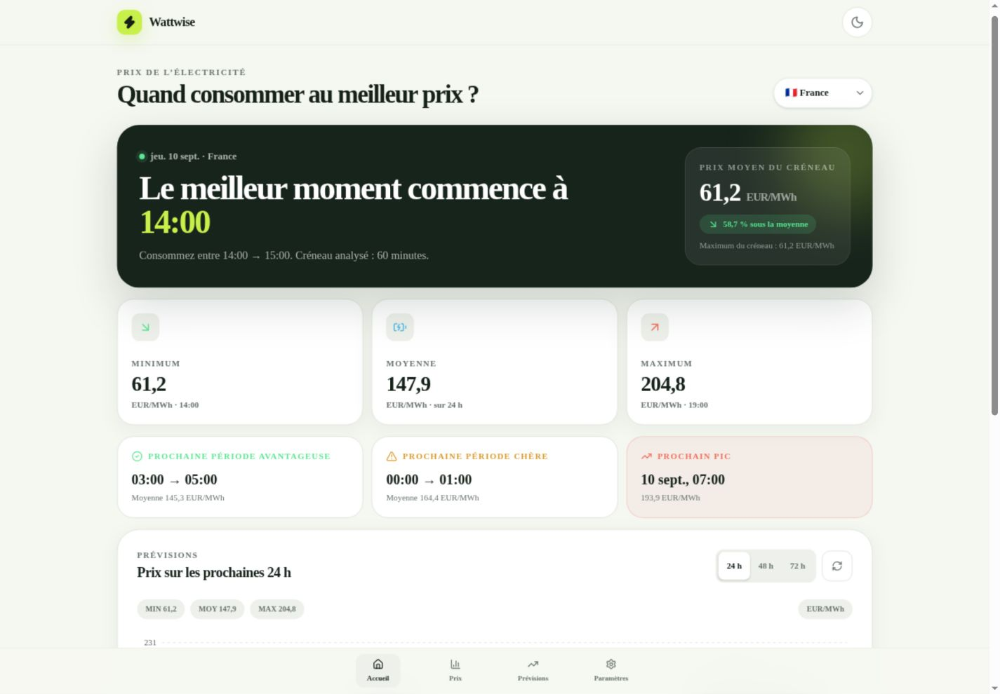
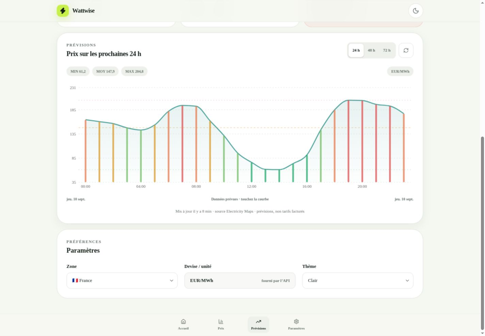
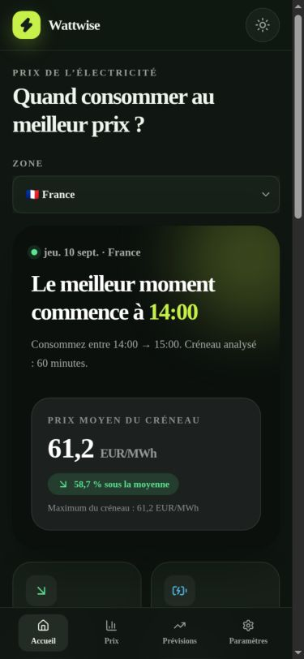
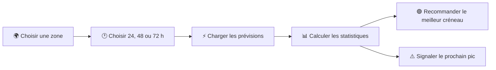

<div align="center">
  
  <h1>⚡ Wattwise</h1>
  <p><strong>Consommez au bon moment.</strong></p>
  <p>
    Une PWA mobile-first qui transforme les prévisions du prix de l’électricité<br />
    en recommandations simples, visuelles et directement utiles.
  </p>

  <p>
    
    
    
    
    
  </p>
</div>

---

## 👀 Aperçu



<table>
  <tr>
    <td width="68%">
      
      <br />
      <sub><strong>Prévisions détaillées :</strong> courbe horaire, niveaux relatifs, minimum, moyenne et maximum.</sub>
    </td>
    <td width="32%" align="center">
      
      <br />
      <sub><strong>Mobile-first :</strong> interface tactile et thème sombre.</sub>
    </td>
  </tr>
</table>

## 🎯 À quoi sert Wattwise ?

Wattwise répond à une question concrète :

> **Quand est-il préférable de consommer de l’électricité ?**

L’application récupère les prévisions *day-ahead* d’[Electricity Maps](https://www.electricitymaps.com/), les analyse, puis présente l’information importante sans jargon :

| Indicateur | Ce qu’il apporte |
| --- | --- |
| 🟢 **Meilleur créneau** | L’heure la moins chère pour lancer un appareil énergivore |
| 📉 **Prix minimum** | Le prix le plus bas de la période sélectionnée |
| ⚖️ **Prix moyen** | Le niveau de référence des prochaines 24, 48 ou 72 heures |
| 📈 **Prix maximum** | Le prix le plus élevé prévu |
| ✅ **Période avantageuse** | Le prochain ensemble d’heures relativement bon marché |
| ⚠️ **Prochain pic** | Le prochain moment où le prix devient particulièrement élevé |
| 💰 **Économie potentielle** | L’écart entre le meilleur créneau et le prix moyen |

## ✨ Fonctionnalités

- 🌍 **Six zones européennes** : France, Allemagne, Belgique, Espagne, Italie du Nord et Pays-Bas
- 🕐 **Prévisions 24 h, 48 h et 72 h** lorsque le plan API les autorise
- 📊 **Graphique tactile et responsive** avec tooltip, quintiles et repères statistiques
- 🎨 **Classification relative** : très bon marché, bon marché, moyen, cher et très cher
- 🌗 **Thèmes système, clair et sombre**
- 📱 **PWA installable** avec manifeste, icône, mode standalone et service worker
- 📴 **Continuité hors ligne** grâce à la dernière prévision disponible, toujours signalée comme ancienne
- 🔄 **Cache de 15 minutes** pour limiter les appels API inutiles
- ♿ **Interface accessible** : labels, navigation clavier, contraste et informations non dépendantes de la couleur
- 🔐 **Clé API protégée côté serveur**, jamais incluse dans le navigateur

## 🧭 Parcours utilisateur



La navigation tient sur un seul écran logique : **Accueil**, **Prix**, **Prévisions** et **Paramètres** sont accessibles depuis la barre inférieure.

## 🧠 Comment les recommandations sont calculées

Wattwise n’utilise pas de seuils monétaires arbitraires. Chaque prix est comparé aux autres valeurs de la période affichée grâce à des **quintiles**.

```text
Prix de la période
       ↓
Tri et calcul des quintiles
       ↓
Très bon marché → Bon marché → Moyen → Cher → Très cher
       ↓
Meilleur créneau + prochaines périodes + prochain pic
```

Le meilleur créneau minimise le prix moyen d’une fenêtre contiguë. La V0.1 utilise une durée d’une heure, mais le moteur accepte déjà d’autres durées.

## 🚀 Installation

### Prérequis

- [Node.js](https://nodejs.org/) **22.13 ou supérieur**
- une clé API [Electricity Maps](https://app.electricitymaps.com/)

### 1. Cloner et installer

```bash
git clone https://github.com/nouhailler/Electror.git
cd Electror
npm install
```

### 2. Configurer l’API

```bash
cp .env.example .env
```

Ajoutez ensuite votre clé dans `.env` :

```dotenv
ELECTRICITY_MAPS_API_KEY=votre_cle
NEXT_PUBLIC_SITE_URL=http://localhost:3000
```

> [!IMPORTANT]
> Ne préfixez jamais la clé par `NEXT_PUBLIC_` ou `VITE_`. Le fichier `.env` est ignoré par Git et la clé ne doit jamais être commitée.

### 3. Lancer l’application

```bash
npm run dev
```

Ouvrez [http://localhost:3000](http://localhost:3000).

## 📲 Installer la PWA

Une fois l’application ouverte dans un navigateur compatible :

1. ouvrez le menu du navigateur ;
2. choisissez **Installer l’application** ou **Ajouter à l’écran d’accueil** ;
3. lancez Wattwise comme une application autonome.

Le service worker conserve l’enveloppe de l’application et les ressources statiques. Les réponses API ne sont pas mises en cache aveuglément : la couche métier gère leur fraîcheur et affiche la date de la dernière donnée disponible.

## 🔌 API Electricity Maps

La route serveur interne appelle exclusivement l’endpoint V4 officiel :

```http
GET https://api.electricitymaps.com/v4/price-day-ahead/forecast
auth-token: <clé côté serveur>
```

| Paramètre | Valeur utilisée |
| --- | --- |
| `zone` | Identifiant Electricity Maps configuré pour le pays choisi |
| `horizonHours` | `24`, `48` ou `72` |
| `temporalGranularity` | `hourly` |
| `disableCallerLookup` | `true` |

Références : [prévisions day-ahead](https://app.electricitymaps.com/docs/reference/day-ahead-price/forecast) · [authentification](https://app.electricitymaps.com/docs/quickstart/authorization).

## 🏗️ Architecture

```text
app/
├── api/forecast/route.ts       # Proxy sécurisé, timeout, cache et erreurs HTTP
├── layout.tsx                  # Métadonnées et configuration PWA
└── page.tsx                    # Point d’entrée de l’interface
src/
├── api/                        # Client de la route interne
├── components/                 # Dashboard, graphique et skeleton
├── config/                     # Noms des zones ↔ identifiants API
├── hooks/                      # Chargement, cache et états d’interface
├── services/                   # Mapper et logique métier testable
├── test/fixtures/              # Réponses réalistes sans appel réseau
├── types/                      # Modèles API et métier
└── utils/                      # Formatage localisé
public/
├── icon.svg
├── manifest.webmanifest
└── sw.js
```

```mermaid
flowchart TD
  UI[📱 Interface React] --> HOOK[useForecast]
  HOOK --> LOCAL[(Cache local)]
  HOOK --> CLIENT[Client API interne]
  CLIENT --> PROXY[/api/forecast]
  PROXY --> SERVER[(Cache serveur 15 min)]
  PROXY --> MAPS[⚡ Electricity Maps]
  HOOK --> ANALYSIS[Analyse métier]
  ANALYSIS --> UI
```

## 🧰 Stack technique

| Domaine | Technologie |
| --- | --- |
| Interface | React 19, TypeScript strict |
| Build | Vinext, Vite |
| Styles | Tailwind CSS |
| Graphiques | Recharts |
| Tests | Vitest |
| PWA | Manifest Web App, service worker, cache local |
| Hébergement | Sortie ESM compatible Cloudflare Workers |

## ✅ Qualité et tests

```bash
npm test          # tests métier
npm run typecheck # validation TypeScript
npm run lint      # qualité et accessibilité statique
npm run build     # build de production
```

Les tests couvrent notamment :

- la transformation de la réponse Electricity Maps ;
- les réponses vides ou incomplètes ;
- le minimum, le maximum et la moyenne ;
- le meilleur créneau paramétrable ;
- le prochain pic ;
- la classification relative des prix.

## 🔐 Sécurité

```text
Navigateur                       Serveur                      Electricity Maps
    │                               │                                │
    ├── GET /api/forecast ─────────►│                                │
    │                               ├── auth-token: secret ─────────►│
    │                               │◄──────── prévisions ───────────┤
    │◄──────── données métier ──────┤                                │
```

- la clé n’est jamais écrite en dur ;
- elle n’est jamais envoyée au navigateur ;
- elle n’est jamais stockée dans `localStorage` ;
- les erreurs amont sont transformées en messages compréhensibles ;
- le proxy applique une validation des zones, un timeout et une limitation naturelle par cache.

## ⚠️ Limites de la V0.1

- l’accès dépend du plan et de la durée de validité de la clé Electricity Maps ;
- les horizons 48/72 h peuvent dépendre des droits du plan ;
- l’Italie utilise la zone de marché `IT-NO` ;
- l’unité est affichée telle que fournie par l’API, sans conversion ;
- les prix *day-ahead* ne correspondent pas nécessairement au tarif final facturé ;
- aucune donnée simulée n’est présentée lorsque l’API est indisponible.

## 🗺️ Pistes pour la V0.2

- durée de consommation personnalisable ;
- alertes de prix et notifications PWA ;
- comparaison de plusieurs zones ;
- historique et comparaison prévisions/réalité ;
- planification d’appareils ou de recharge électrique.

---

<div align="center">
  <strong>Wattwise V0.1</strong><br />
  Prévisions fournies par Electricity Maps — les prix affichés ne sont pas des tarifs contractuels.
</div>
